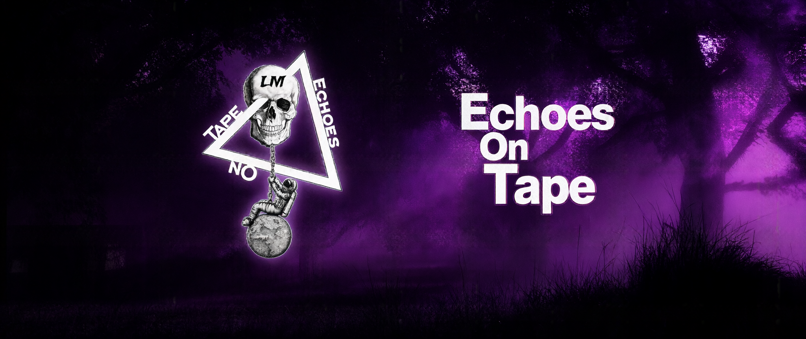
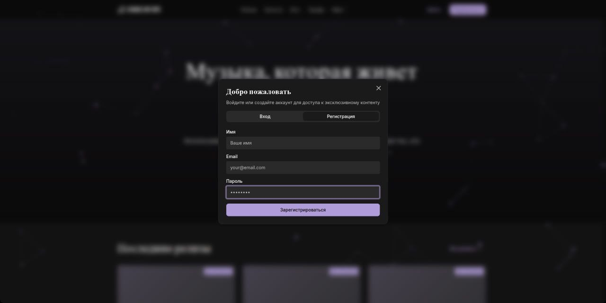
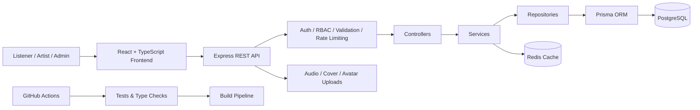
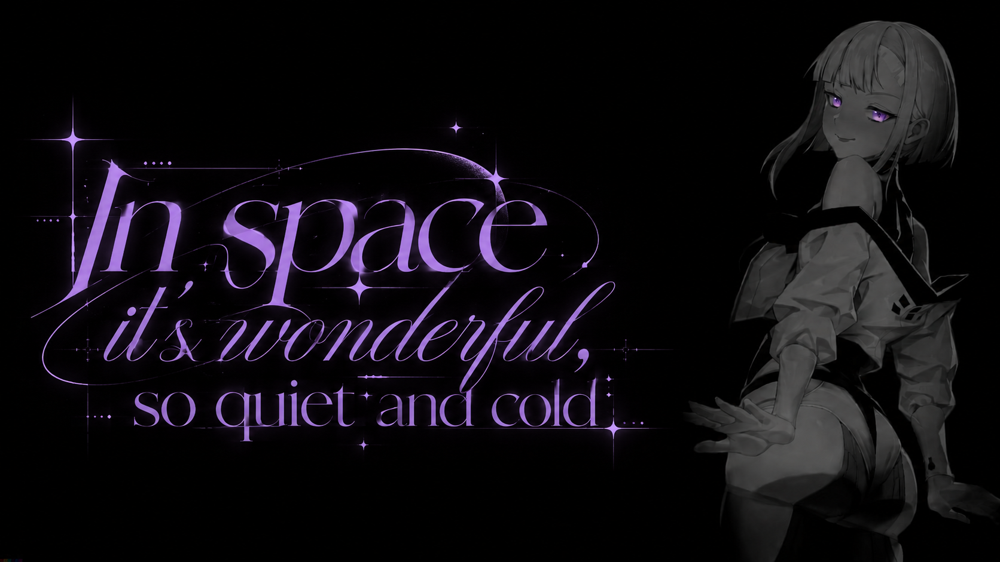

<!--
  Echoes On Tape
  Open-source platform for independent music labels.

  README visual assets planned:
  docs/assets/readme/banner.webp
  docs/assets/readme/home.webp
  docs/assets/readme/releases.webp
  docs/assets/readme/artist.webp
  docs/assets/readme/showcase.webp
-->

<p align="center">
  
</p>

<h1 align="center">Echoes On Tape</h1>

<p align="center">
  <strong>An open-source full-stack platform for independent music labels.</strong>
</p>

<p align="center">
  Releases, artists, community, exclusive content and direct-to-fan experiences — in one platform.
</p>

<p align="center">
  <a href="https://github.com/Akaikage15/Echoes-On-Tape-full">
    
  </a>
  <a href="https://github.com/Akaikage15/Echoes-On-Tape-full/actions/workflows/backend-ci.yml">
    
  </a>
  
  
  
  
</p>

<p align="center">
  <a href="#about">About</a>
  ·
  <a href="#features">Features</a>
  ·
  <a href="#architecture">Architecture</a>
  ·
  <a href="#roadmap">Roadmap</a>
  ·
  <a href="#development">Development</a>
  ·
  <a href="#contributing">Contributing</a>
</p>

---

> [!IMPORTANT]
> **Echoes On Tape is currently in active development and has not been publicly launched yet.**
>
> The repository represents a real working platform being developed for an independent music label, but some production, legal, commerce and deployment work is still in progress.

## About

**Echoes On Tape** is an independent music label platform built around a simple idea:

> Artists should be able to build a direct relationship with their listeners instead of depending entirely on algorithms and fragmented third-party platforms.

Streaming platforms are excellent for distribution, but they are not designed to be a complete digital home for a small label.

An independent label may need one service for releases, another for news, another for merchandise, another for exclusive content, another for community interaction, and yet another for collecting demo submissions.

Echoes On Tape aims to bring those pieces together.

The platform is being developed first for our own small independent label and its artists, while remaining open for other developers and labels to study, fork and adapt for their own projects.

The project currently has **one developer** working alongside their studies and is also used as a practical environment for learning full-stack engineering, infrastructure and AI-assisted software development.

---

## Why Echoes On Tape?

Echoes On Tape is not intended to replace Spotify, Apple Music, YouTube Music or other distribution platforms.

It is intended to become the layer **around them**.

A place where a label can control its identity, publish releases and editorial content, present its artists, build a community and eventually create direct monetization channels without making its audience jump between a collection of unrelated services.

### For listeners

Discover releases and artists, follow label news, access exclusive content and interact more directly with the people behind the music.

### For artists

Maintain an artist identity, publish releases, connect social platforms, share exclusive material and build a closer relationship with listeners.

### For labels

Manage releases, artists, content, subscriptions, community features, uploads and future commerce from one technical foundation.

---

## Showcase

<!--
Replace this section when screenshots are prepared.

Recommended layout:

<p align="center">
  
</p>

<table>
  <tr>
    <td width="50%">
      
    </td>
    <td width="50%">
      
    </td>
  </tr>
  <tr>
    <td width="50%">
      
    </td>
    <td width="50%">
      
    </td>
  </tr>
</table>
--><p align="center">
  
</p>

---

## Features

### Music & discovery

- Artist profiles
- Release catalog
- Individual release pages
- Streaming links
- Release filtering
- Custom music-oriented UI
- News and editorial content
- Exclusive content infrastructure

### Accounts & community

- User registration and authentication
- Access and refresh token flow
- User profiles
- Profile biographies
- Social links
- Account settings
- Role-based permissions
- Subscription-aware access
- Community polls

### Artists & label tools

- Artist roles
- Cover uploads
- Audio uploads
- Avatar uploads
- Demo submission infrastructure
- Merchandise catalog infrastructure
- PRO content library
- Exclusive material management

### Platform & backend

- REST API
- PostgreSQL database
- Prisma ORM
- Redis caching
- Zod validation
- Role-Based Access Control
- Rate limiting
- Centralized error handling
- Winston logging
- Swagger / OpenAPI documentation
- Health, readiness and liveness endpoints

### Engineering

- TypeScript across frontend and backend
- Automated backend tests
- Frontend tests with Jest
- End-to-end testing with Playwright
- GitHub Actions CI/CD
- Dockerized backend infrastructure
- PostgreSQL and Redis Docker services
- Production-oriented layered backend architecture

---

## Technology Stack

| Area | Technologies |
| --- | --- |
| Frontend | React 18, TypeScript, Vite |
| UI | shadcn/ui, Radix UI, Lucide |
| State | Zustand |
| Networking | Axios |
| Backend | Node.js, Express 5, TypeScript |
| Database | PostgreSQL |
| ORM | Prisma |
| Cache | Redis, ioredis |
| Validation | Zod |
| Authentication | JWT, refresh tokens, HTTP-only cookies |
| Authorization | RBAC |
| Logging | Winston |
| API Docs | Swagger / OpenAPI |
| Testing | Jest, React Testing Library, Supertest, Playwright |
| Infrastructure | Docker, Docker Compose |
| CI/CD | GitHub Actions |

---

## Architecture

Echoes On Tape uses a React frontend connected to a layered Express API.



### Backend structure

```text
backend/src/


**Practical.**  
Features should solve real problems for artists, listeners or label operators.

**Understandable.**  
The codebase should remain approachable to developers who are still learning.

**Self-hostable.**  
Core functionality should not unnecessarily depend on proprietary infrastructure.

**Artist-focused.**  
Technology exists to strengthen the relationship between artists and their listeners, not replace it.

---

## Who Is Building This?

Echoes On Tape is currently created by a small three-person team around an independent music label.

The technical side of the project is maintained by a **single student developer**, who works on the platform alongside their studies.

For the developer, Echoes On Tape is both a real product and a learning environment for gaining practical experience with:

- full-stack development
- backend architecture
- databases
- infrastructure
- testing
- security
- open-source development
- AI-assisted software engineering

This also means development may move more slowly than a project backed by a dedicated engineering team.

That limitation is part of the reason the project is open: knowledge, improvements and contributions should be able to accumulate beyond a single developer.

---

## Vision

Most independent artists already publish their music through large streaming services.

What they often do not have is a place they truly control.

Echoes On Tape wants to become that place.

A digital home where music, artists, community, editorial content and direct support can exist together — while remaining open enough for other small labels to build their own version of it.

> **Music beyond the algorithm.**

---

## Acknowledgements

Echoes On Tape is built on top of many open-source projects, including:

[React](https://react.dev/) ·
[Vite](https://vite.dev/) ·
[Express](https://expressjs.com/) ·
[PostgreSQL](https://www.postgresql.org/) ·
[Prisma](https://www.prisma.io/) ·
[Redis](https://redis.io/) ·
[shadcn/ui](https://ui.shadcn.com/) ·
[Radix UI](https://www.radix-ui.com/) ·
[Zod](https://zod.dev/) ·
[Playwright](https://playwright.dev/)

---

<p align="center">
  <strong>Echoes On Tape</strong>
  <br />
  Independent music. Direct connection. Open infrastructure.
</p>

<p align="center">
  
</p>
